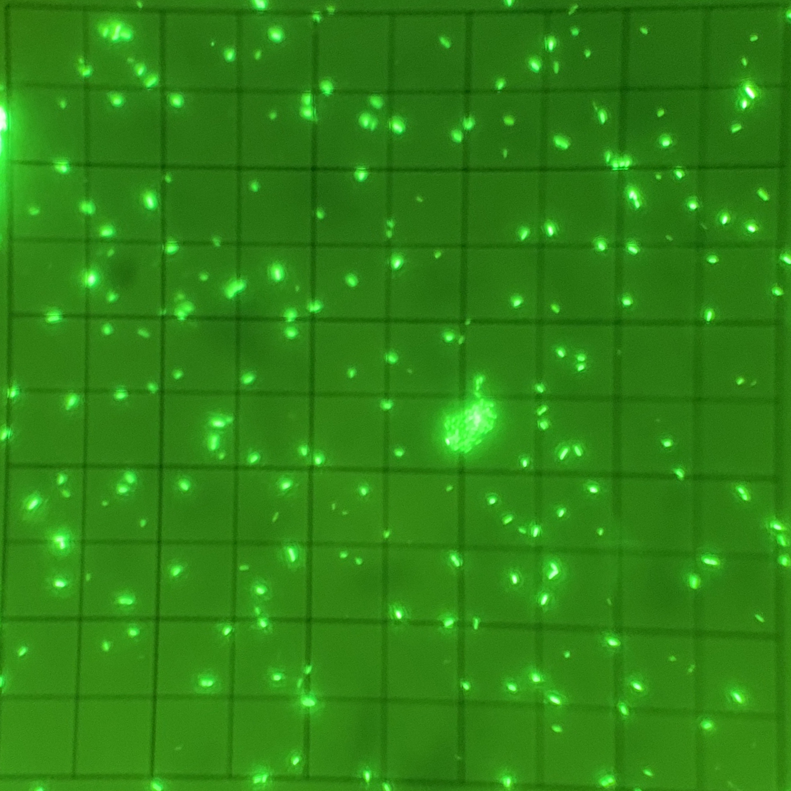
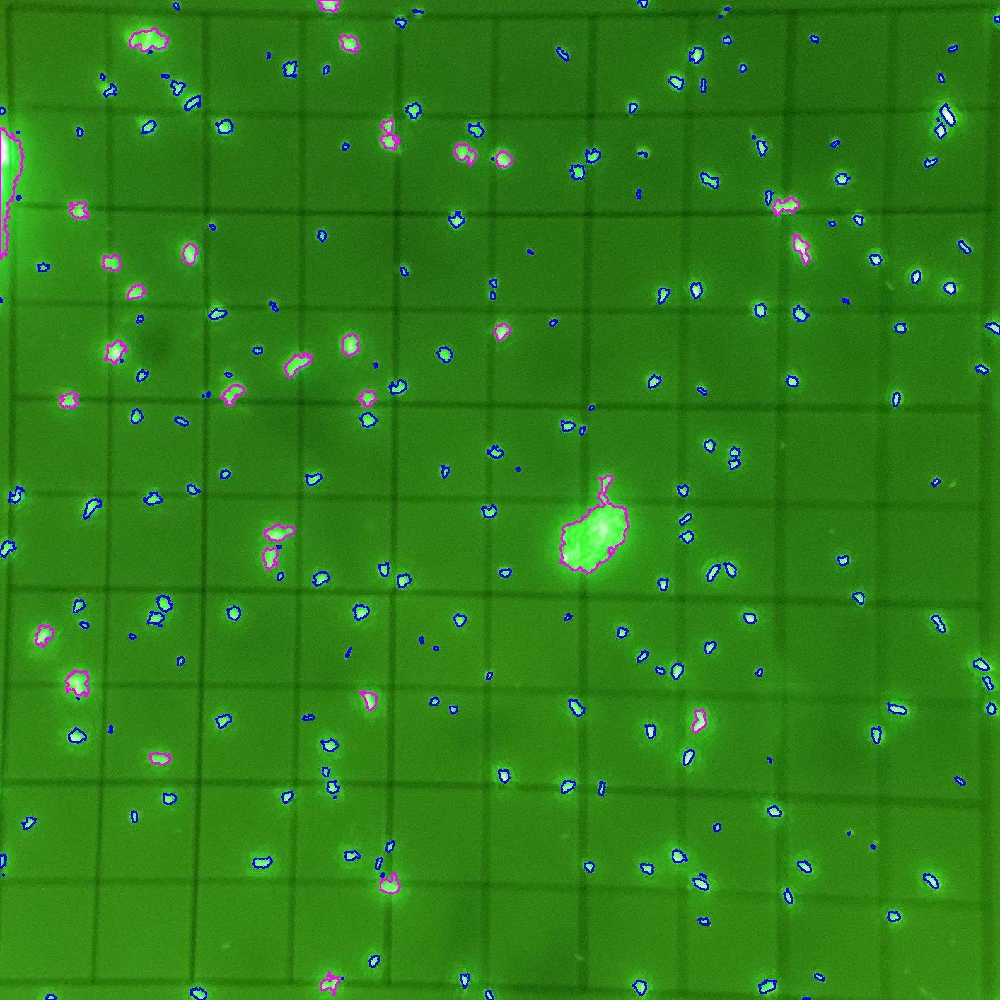
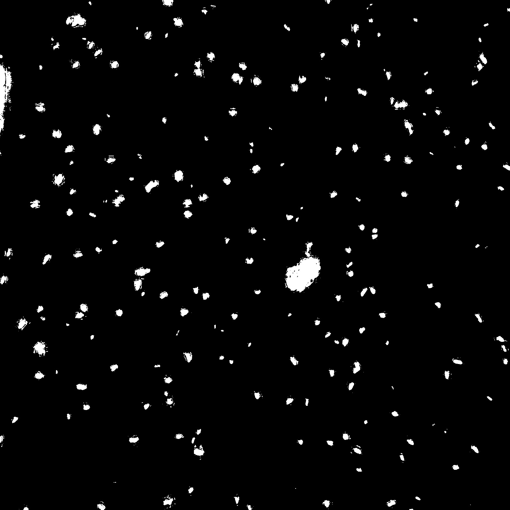

# basic cell counter
a python program used to count cells in an image

## how to use
provide the program with an input image
eg: 

program will calculate approximate number of cells in the image

if -o flag is used, program will save the highlighted output image
eg: 

if -m flag is used, program will save the generated mask image
eg: 

### args:
        -i: input file to count
        -o: optional output file to save with highlighted contours
        -m: optional output file to save generated image mask
        -v: optional verbose flag to print cells as it counts and display generated cell mask
        -h: shows usage
usage: count_cells.py [-h] -i <input_image> [-o <output_image>] [-m <mask_image>] [-v]
